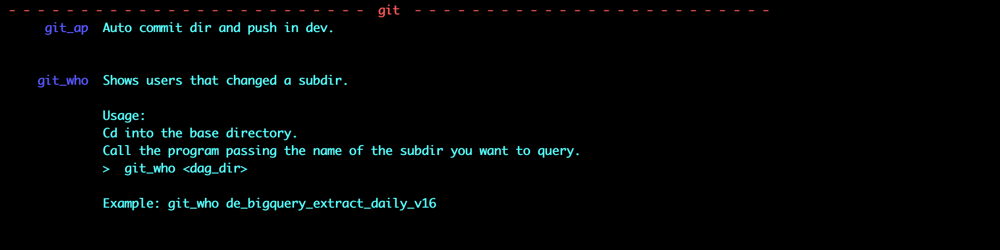
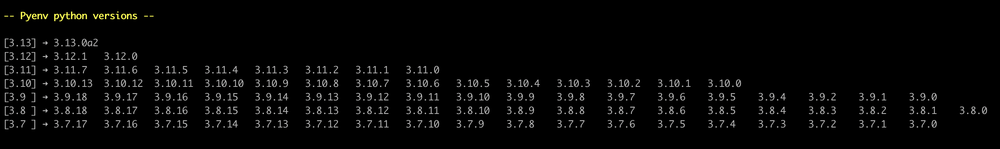

|

.
#

1. Introduction
---------------

CmdWerk is a minimalist tool that helps you manage your scripts.
You can also extend it with new modules.

As an example, we include two modules:
    1. An interactive prompt that learns from your command history.
    2. Pyenv report that shows a list of available versions

It processes your shell scripts stored in your $HOME/bin.

With CmdWerk, you can effortlessly organize your scripts into groups, enhancing your workflow and making script management a breeze.

2. Getting Started
------------------

Use this command to package the project and install the newly built package.
We recommend using pipx to keep the tool available across virtual environments.

.. code-block:: console

   $ ./reinstall.sh

Here are the commands included in the reinstall.sh

.. code-block:: bash

    #!/bin/bash
    make
    pipx uninstall cmdwerk
    PACKAGE_FILE=$(ls dist/*.gz | grep cmdwerk | head -n 1)
    pipx install $PACKAGE_FILE
dist/cmdwerk-0.1.0.tar.gz

3. Adapting bash scripts to appear on reports
---------------------------------------------

As an example, here is a small bash script without the config.

.. code-block:: bash

    #!/bin/bash
    vi ~/.ssh/config

And here is the same script documented.

.. code-block:: bash

    #!/bin/bash

    # -- Cmd Werk Config --
    # CMDW_GROUP_NAME='aws & ssh'
    # CMDW_HELP_BEGIN
    # Edits ssh config file.
    # CMDW_HELP_END

vi ~/.ssh/config
    vi ~/.ssh/config

4. Adapting python scripts to appear in reports
-----------------------------------------------

Here is the original python script code.

.. code:: python

    #!/usr/bin/env python3
    """
    A simple python password generator script configured for cmdwerk
    """

    import random
    import string

    def generate_password(pass_length):
        characters = string.ascii_letters + string.digits + string.punctuation
        return ''.join(random.choice(characters) for _ in range(pass_length))

    password = generate_password(15)
    print(f' Your new password is: {password}')

Here is the modified code.

.. code:: python

    #!/usr/bin/env python3
    """
    A simple python password generator script configured for cmdwerk
    """

    import random
    import string

    # -- Cmd Werk Config --
    # CMDW_GROUP_NAME='tools'
    # CMDW_HELP_BEGIN
    # Generates passwords example.
    # CMDW_HELP_END

    def generate_password(pass_length):
        characters = string.ascii_letters + string.digits + string.punctuation
        return ''.join(random.choice(characters) for _ in range(pass_length))

    password = generate_password(15)
    print(f' Your new password is: {password}')

5. Commands to list scripts
---------------------------

5.1. List the scripts with short details

.. code-block:: console

    $ cmdw bins

will produce the following results

5.2. List the scripts of a group with detailed descriptions

.. code-block:: console

    $ cmdw bins --group git

will produce the following results

5.3. Report the status of script registrations

This report has two parts:
   a. List of registered scripts and the group its registered under.
   b. List the scripts not registered.

.. code-block:: console

    $ cmdw bins status

will produce the following results

6. Commands to report on pyenv versions
---------------------------------------

The list will include only the official Python versions
from version 3.7 or later.

.. code-block:: console

    $ cmdw pyenv-list

will produce the following results

7. Commands for the interactive prompt
--------------------------------------

7.1. Command to start the interactive prompt

.. code-block:: console

    $ cmdw ppt

Start typying the command and use TAB to navigate in the dropdown and SPACE to select the current option.

'ENTER' exits the app and adds the whole command to the clipboard.

7.2. Command to sync the prompt data with the history file.

.. code-block:: console

    $ cmdw ppt sync

it will produce a summary report like below:

.. code-block:: console

    Saved history data to /Users/mcampos/.cmdwerk/history.bin
    History lines : 2837
    Loading errors: 1
